# Medical Second Opinion Platform - Architecture Documentation

## 🏗️ System Architecture Overview

The Medical Second Opinion Platform is a secure, multi-role web application built with Next.js, featuring role-based access control, secure file handling, and integrated module communication.

## 📊 High-Level Architecture Diagram

```mermaid
graph TB
    subgraph "User Interface Layer"
        subgraph "Patient Interface"
            A[Patient Portal] --> B[Multi-step Form]
        end
        
        subgraph "Customer Interface"
            C[Customer Portal] --> D[Case Dashboard]
        end
        
        subgraph "Professional Interface"
            E[Professional Portal] --> F[Case Review Interface]
            E --> G[Profile Management]
            E --> H[Account Management]
            E --> I[Application & Vetting Process]
        end
        
        subgraph "Admin Interface"
            J[Admin Portal] --> K[System Management Dashboard]
            J --> L[Professional Vetting & Approval]
            J --> M[Case Assignment & Monitoring]
            J --> N[User Management]
            J --> O[System Analytics & Reports]
        end
    end

    subgraph "API Layer"
        N[Next.js API Routes]
        O[Authentication]
        P[File Upload]
        Q[Case Management]
        R[Professional Application APIs]
    end

    subgraph "Business Logic Layer"
        S[Repository Module]
        T[Customer Lifecycle Module]
        U[Invoicing & Accounting Module]
        V[Professional Recruitment Module]
        W[Case Review Module]
        X[Payment & Billing Service]
    end

    subgraph "Data Layer"
        Y[(SQLite Database)]
        Z[Local File Storage]
        AA[External AI Analysis]
    end

    subgraph "Quality Assurance Layer"
        BB[Test Manager Agent]
        CC[Cross-Browser Testing Suite]
        DD[Automated Health Monitoring]
        EE[Performance Benchmarking]
    end

    subgraph "External Services"
        FF[Email Service]
        GG[SMS Service]
        HH[Payment Gateway]
    end

    %% User interfaces connect to API layer
    A --> N
    C --> N
    E --> N
    J --> N
    
    %% API layer connects to business logic
    N --> S
    N --> T
    N --> U
    N --> V
    N --> W
    N --> X
    
    %% Business logic connects to data layer
    S --> Y
    S --> Z
    S --> AA
    T --> Y
    U --> Y
    V --> Y
    W --> Y
    X --> Y
    
    %% Quality Assurance layer monitors all components
    BB --> N
    BB --> S
    BB --> T
    BB --> U
    BB --> V
    BB --> W
    BB --> X
    CC --> N
    DD --> Y
    DD --> Z
    EE --> N
    
    %% Business logic connects to external services
    T --> FF
    T --> GG
    U --> HH
    X --> HH
```

## 🔄 System Flow Diagrams

### 1. Patient Case Submission Flow

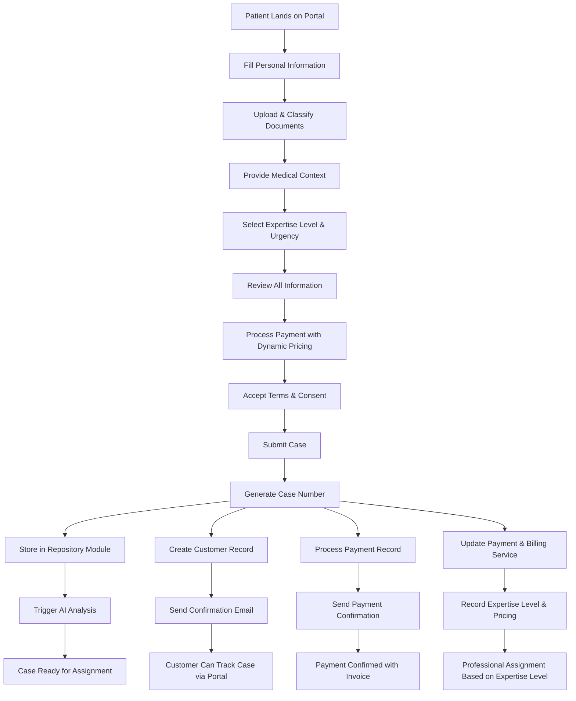

### 2. Professional Case Review Flow

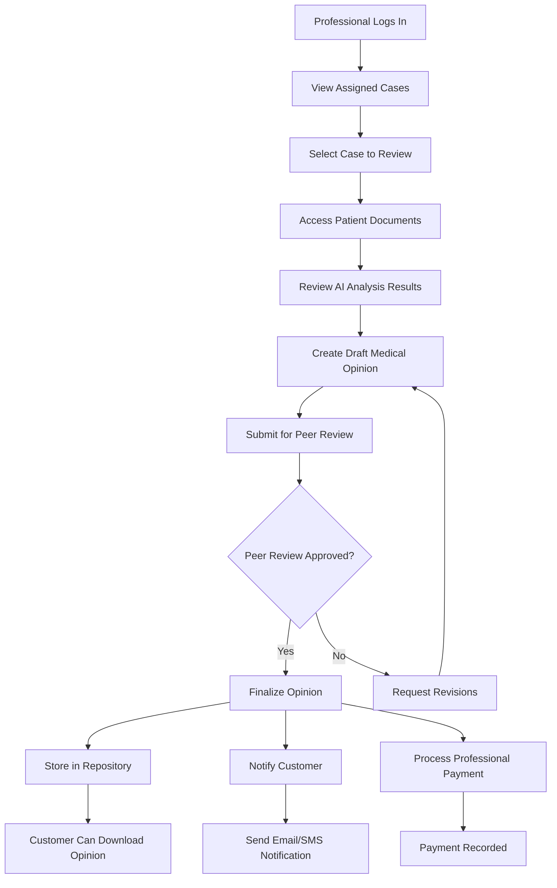

### 3. Admin Management Flow

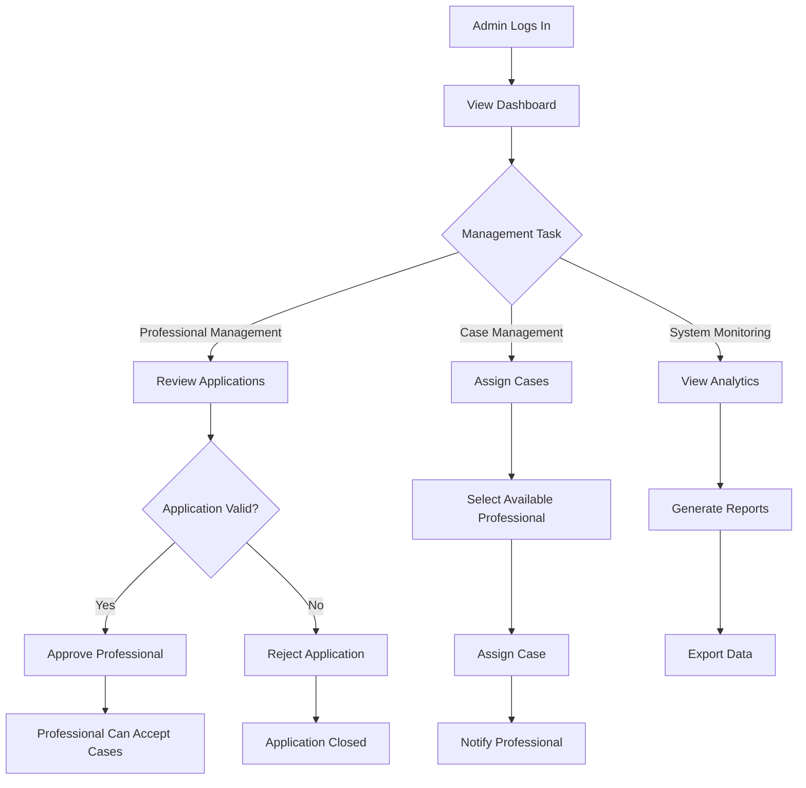

### 4. Cross-Browser Testing & Quality Assurance Flow

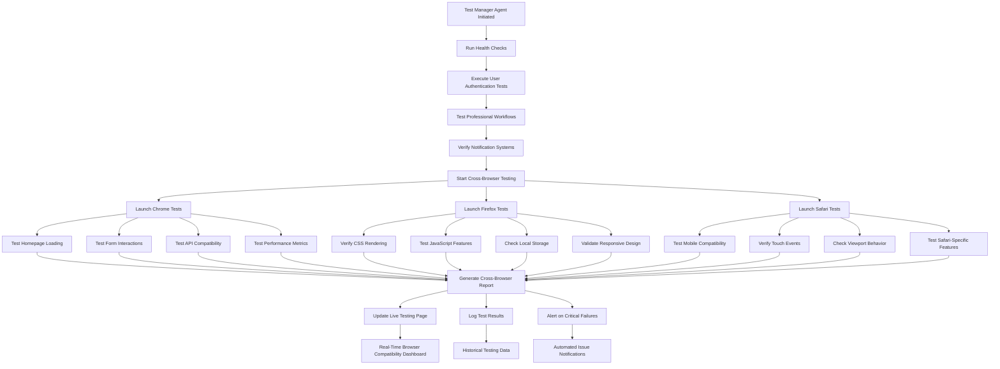

## 🏛️ Component Architecture

### Frontend Components Structure

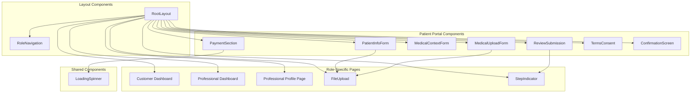

### API Routes Architecture

```mermaid
graph TD
    subgraph "File Management APIs"
        A[/api/presign-upload]
        B[/api/upload/dev-put]
    end
    
    subgraph "Case Management APIs"
        C[/api/upload-request]
        D[/api/ai-analysis]
    end
    
    subgraph "Communication APIs"
        E[/api/acknowledgement]
        F[/api/payment-confirmation]
    end
    
    subgraph "Role-Specific APIs"
        G[/api/customer/dashboard]
        H[/api/professional/cases]
        I[/api/professional/profile]
        J[/api/professional/account]
        K[/api/admin/management]
    end
    
    subgraph "Authentication APIs"
        J[/api/auth/register]
        K[/api/auth/login]
    end
    
    A --> B
    C --> D
    E --> F
    G --> H
    H --> I
    I --> J
    J --> K
    K --> L
```

## 🗄️ Database Schema Architecture

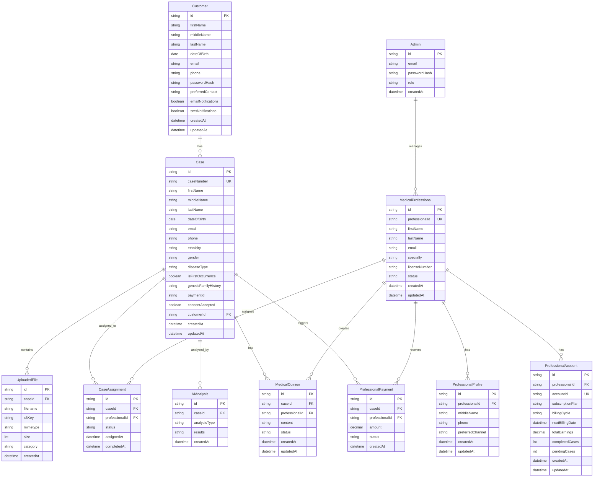

## 🔐 Security Architecture

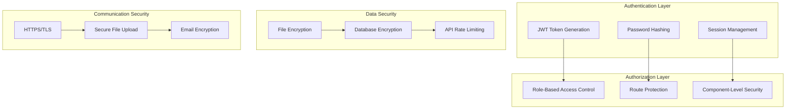

## 📱 User Interface Flow

### Patient Journey

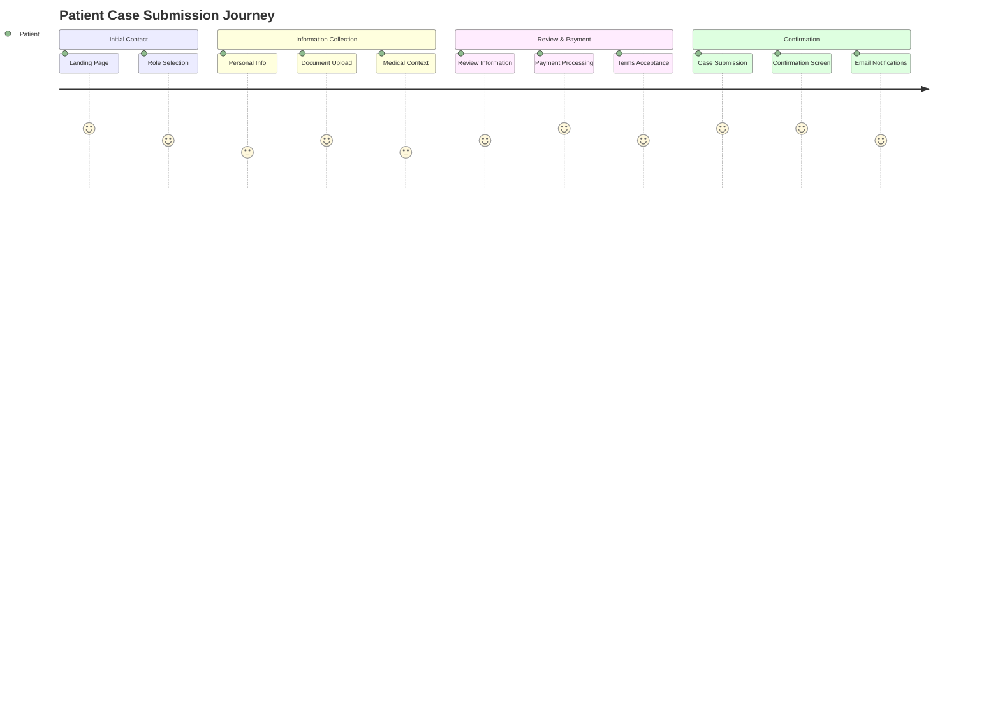

### Professional Journey

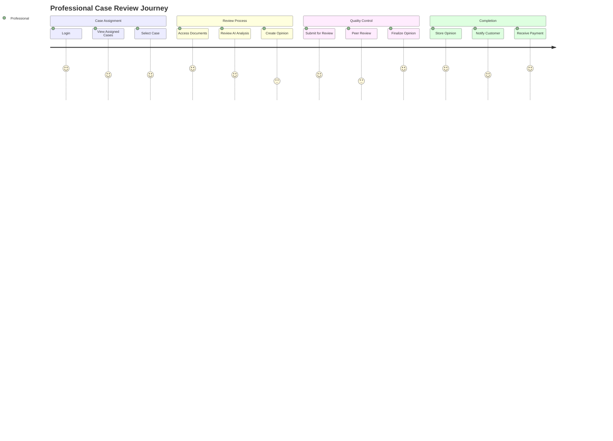

## 🔧 Technical Stack Architecture

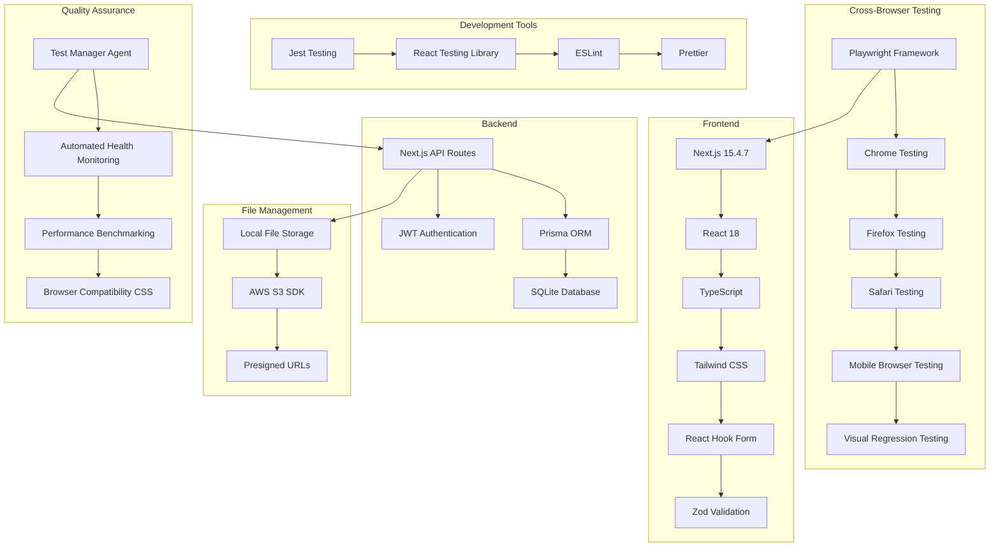

## 📈 Performance Architecture

```mermaid
graph TD
    subgraph "Frontend Performance"
        A[Code Splitting]
        B[Lazy Loading]
        C[Image Optimization]
        D[CSS Optimization]
    end
    
    subgraph "Backend Performance"
        E[Database Indexing]
        F[Query Optimization]
        G[Connection Pooling]
        H[Caching Strategy]
    end
    
    subgraph "File Performance"
        I[Parallel Uploads]
        J[Chunked Uploads]
        K[Progress Tracking]
        L[Retry Logic]
    end
    
    subgraph "Monitoring"
        M[Error Tracking]
        N[Performance Metrics]
        O[User Analytics]
        P[System Health]
    end
    
    A --> B
    B --> C
    C --> D
    
    E --> F
    F --> G
    G --> H
    
    I --> J
    J --> K
    K --> L
    
    M --> N
    N --> O
    O --> P
```

## 🚀 Deployment Architecture

```mermaid
graph TD
    subgraph "Development Environment"
        A[Local Development]
        B[SQLite Database]
        C[Local File Storage]
        D[Hot Reload]
    end
    
    subgraph "Production Environment"
        E[Vercel/Netlify]
        F[PostgreSQL Database]
        G[AWS S3 Storage]
        H[CDN Distribution]
    end
    
    subgraph "CI/CD Pipeline"
        I[GitHub Actions]
        J[Automated Testing]
        K[Build Process]
        L[Deployment]
    end
    
    subgraph "Monitoring & Logging"
        M[Error Tracking]
        N[Performance Monitoring]
        O[Security Scanning]
        P[Backup Strategy]
    end
    
    A --> B
    B --> C
    C --> D
    
    E --> F
    F --> G
    G --> H
    
    I --> J
    J --> K
    K --> L
    
    M --> N
    N --> O
    O --> P
```

## 📋 Key Architectural Decisions

### 1. **Monolithic Next.js Application**
- **Rationale**: Simplified deployment, shared codebase, easier state management
- **Benefits**: Single codebase, unified authentication, shared components
- **Trade-offs**: Larger bundle size, less microservice flexibility

### 2. **SQLite for Development, PostgreSQL for Production**
- **Rationale**: Easy local development with production-ready scalability
- **Benefits**: Zero-config local setup, robust production database
- **Trade-offs**: Database migration complexity

### 3. **Local File Storage with S3 Fallback**
- **Rationale**: Development simplicity with production scalability
- **Benefits**: No external dependencies for development, secure production storage
- **Trade-offs**: Different storage APIs, migration complexity

### 4. **Role-Based Access Control**
- **Rationale**: Secure multi-tenant application with distinct user types
- **Benefits**: Clear separation of concerns, secure access control
- **Trade-offs**: Complex routing logic, role management overhead

### 5. **Multi-Step Form Architecture**
- **Rationale**: Complex data collection with validation and user experience
- **Benefits**: Progressive disclosure, validation at each step, better UX
- **Trade-offs**: State management complexity, navigation logic

## 🔮 Future Architecture Considerations

### 1. **Microservices Migration**
- Separate services for each module (Repository, Customer Lifecycle, etc.)
- API Gateway for unified access
- Event-driven communication between services

### 2. **Real-time Features**
- WebSocket integration for live updates
- Real-time notifications
- Live chat between professionals and customers

### 3. **Advanced AI Integration**
- Direct AI service integration
- Machine learning for case prioritization
- Automated document analysis

### 4. **Mobile Application**
- React Native or Flutter mobile app
- Offline capability
- Push notifications

### 5. **Cross-Browser Testing Infrastructure**
- Playwright-based automated testing across 8 browser projects
- Real-time browser compatibility monitoring with live testing page
- Browser-specific optimization layer for Safari, Firefox, Chrome, and mobile browsers
- Integration with Test Manager Agent for continuous quality assurance

### 6. **Enhanced Payment Processing**
- Dynamic pricing calculation based on expertise levels (Junior, Senior, Expert, Distinguished)
- Real-time integration with Payment & Billing Service (port 4007)
- Urgency multipliers for standard, urgent, and emergency case processing
- Customer portal integration for payment tracking and invoice management

### 7. **Internationalization**
- Multi-language support
- Regional compliance (GDPR, HIPAA, etc.)
- Localized payment processing

## 🧪 Cross-Browser Testing Architecture & Workflow

### Testing Infrastructure Overview

The Medical Second Opinion Platform implements comprehensive cross-browser testing to ensure consistent functionality and user experience across all major browsers and devices.

### Test Manager Agent Integration

**File**: `agents/test-manager.js`  
**Integration Point**: Step 6 of Full Test Suite

The Test Manager Agent now includes cross-browser testing as an integral part of the platform's quality assurance workflow:

```javascript
// Enhanced Test Manager Flow
async runFullTestSuite() {
  // ... existing tests ...
  
  // 6. Cross-browser compatibility tests
  await this.testCrossBrowserCompatibility();
  
  // Automated testing across Chrome, Firefox, Safari
  // Performance benchmarking per browser
  // Visual regression detection
  // Mobile compatibility verification
}
```

### Cross-Browser Test Suite Components

1. **Functional Tests** (`tests/e2e/cross-browser.browser.spec.ts`)
   - Homepage loading across browsers
   - Form interactions and validation
   - API compatibility and response handling
   - JavaScript feature support verification
   - Local storage and session storage functionality

2. **Visual Regression Tests** (`tests/e2e/visual-regression.visual.spec.ts`)
   - UI consistency across browser engines
   - Typography and font rendering differences
   - CSS layout and positioning verification
   - Color accuracy and display consistency
   - Responsive design behavior validation

3. **API Compatibility Tests** (`tests/e2e/api-compatibility.api.spec.ts`)
   - Fetch API vs XMLHttpRequest compatibility
   - CORS handling differences
   - JSON parsing and stringification
   - Error response handling consistency
   - Content-type header processing

4. **Mobile Compatibility Tests** (`tests/e2e/mobile-compatibility.mobile.spec.ts`)
   - Touch event handling on iOS Safari and Chrome Mobile
   - Viewport behavior and orientation changes
   - Mobile-specific form interactions
   - Performance metrics on mobile devices
   - Mobile browser-specific API testing

### Live Testing Interface

**URL**: `/cross-browser-test`  
**Purpose**: Real-time browser compatibility verification

The live testing page provides instant feedback on browser compatibility:

- **Browser Detection**: Automatic identification of current browser, version, and capabilities
- **Feature Matrix**: Real-time testing of 60+ JavaScript features and 20+ CSS properties
- **API Testing**: Live verification of all platform endpoints with response time monitoring
- **Performance Metrics**: Navigation timing, memory usage, and connection information
- **Compatibility Recommendations**: Browser-specific optimization suggestions

### Browser Optimization Layer

**File**: `src/styles/browser-compatibility.css`

Comprehensive CSS compatibility layer addressing browser-specific issues:

```css
/* Safari-specific optimizations */
@supports (-webkit-appearance: none) {
  /* Webkit prefixes, font smoothing, input styling */
}

/* Firefox-specific optimizations */
@-moz-document url-prefix() {
  /* Scroll styling, font rendering, focus management */
}

/* Chrome performance enhancements */
@supports (transform: translateZ(0)) {
  /* Hardware acceleration, autofill styling */
}
```

### Automated Testing Workflow

1. **Continuous Integration**: Tests run automatically on code changes
2. **Parallel Execution**: Chrome, Firefox, and Safari tests run simultaneously
3. **Result Aggregation**: Comprehensive reporting with browser-specific metrics
4. **Failure Handling**: Automatic retry logic and detailed error reporting
5. **Performance Monitoring**: Benchmark tracking across browser versions

### NPM Script Integration

```bash
# Complete cross-browser test suite
npm run test:cross-browser

# Browser-specific testing
npm run test:browser:chrome
npm run test:browser:firefox  
npm run test:browser:safari

# Specialized test categories
npm run test:browser:mobile
npm run test:browser:visual
npm run test:browser:api

# Development and debugging
npm run test:browser:headed
npm run test:browser:ui
npm run test:browser:debug
```

### Quality Metrics & Success Criteria

- **Test Coverage**: 105 automated tests across 8 browser projects
- **Browser Support**: Chrome, Firefox, Safari, Edge, Mobile Chrome, Mobile Safari
- **Performance Benchmarks**: First Contentful Paint <1.5s, Largest Contentful Paint <2.5s
- **Compatibility Score**: >95% feature compatibility across target browsers
- **Visual Consistency**: Zero critical visual regressions between browsers

### Browser-Specific Optimizations Applied

1. **Safari**: Webkit prefixes, font smoothing, input zoom prevention, scroll improvements
2. **Firefox**: Scrollbar styling, font rendering, focus management, performance optimizations
3. **Chrome**: Hardware acceleration, autofill styling, memory management
4. **Mobile**: Touch target sizing, viewport fixes, orientation handling, performance tuning
5. **Accessibility**: High contrast support, reduced motion, keyboard navigation
6. **Performance**: GPU acceleration, animation optimization, loading state management

This comprehensive cross-browser testing infrastructure ensures the Medical Second Opinion Platform delivers consistent, high-quality user experiences across all supported browsers and devices.

---

*This architecture documentation provides a comprehensive overview of the Medical Second Opinion Platform's technical design, data flow, system components, and cross-browser compatibility infrastructure.*

