# Medical Second Opinion Platform - Architecture Documentation

## 🏗️ System Architecture Overview

The Medical Second Opinion Platform is a secure, multi-role web application built with Next.js, featuring role-based access control, secure file handling, and integrated module communication.

## 📊 High-Level Architecture Diagram

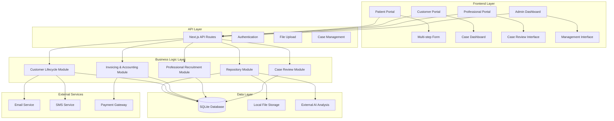

## 🔄 System Flow Diagrams

### 1. Patient Case Submission Flow

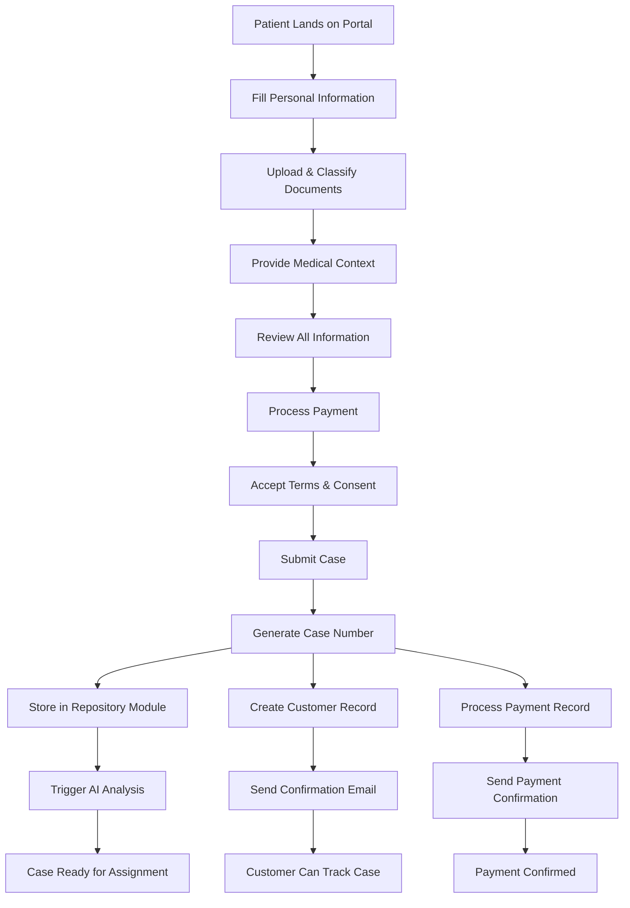

### 2. Professional Case Review Flow

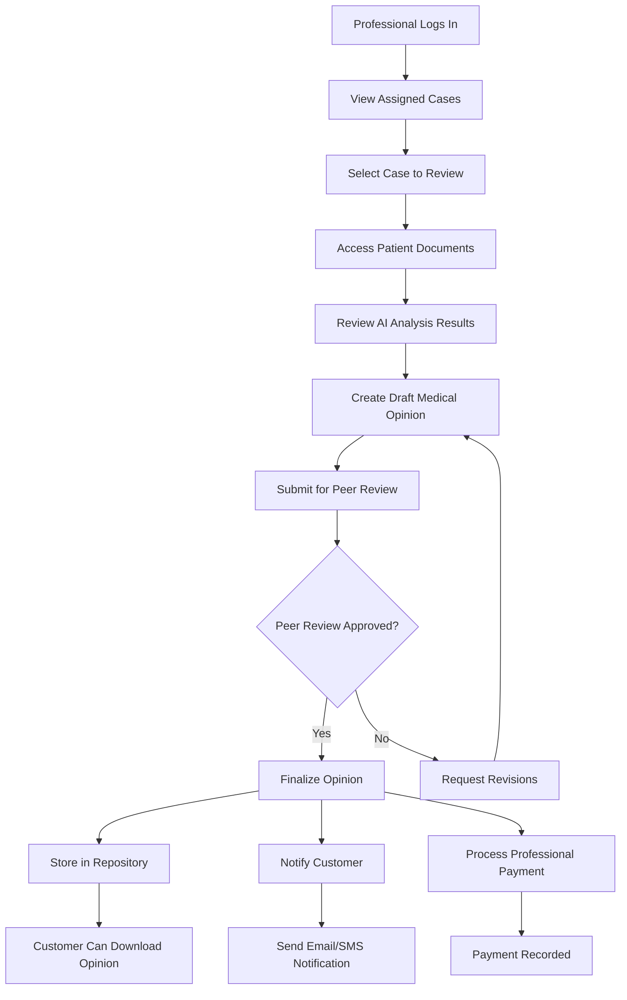

### 3. Admin Management Flow

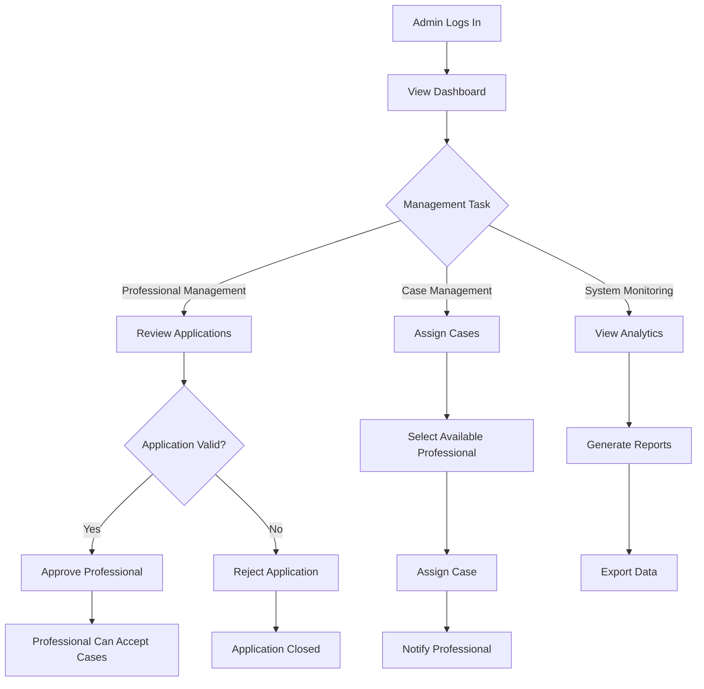

## 🏛️ Component Architecture

### Frontend Components Structure

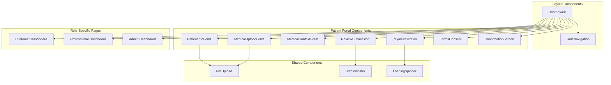

### API Routes Architecture

```mermaid
graph TD
    subgraph "File Management APIs"
        A[/api/presign-upload]
        B[/api/upload/dev-put]
    end
    
    subgraph "Case Management APIs"
        C[/api/upload-request]
        D[/api/ai-analysis]
    end
    
    subgraph "Communication APIs"
        E[/api/acknowledgement]
        F[/api/payment-confirmation]
    end
    
    subgraph "Role-Specific APIs"
        G[/api/customer/dashboard]
        H[/api/professional/cases]
        I[/api/admin/management]
    end
    
    subgraph "Authentication APIs"
        J[/api/auth/register]
        K[/api/auth/login]
    end
    
    A --> B
    C --> D
    E --> F
    G --> H
    H --> I
    J --> K
```

## 🗄️ Database Schema Architecture

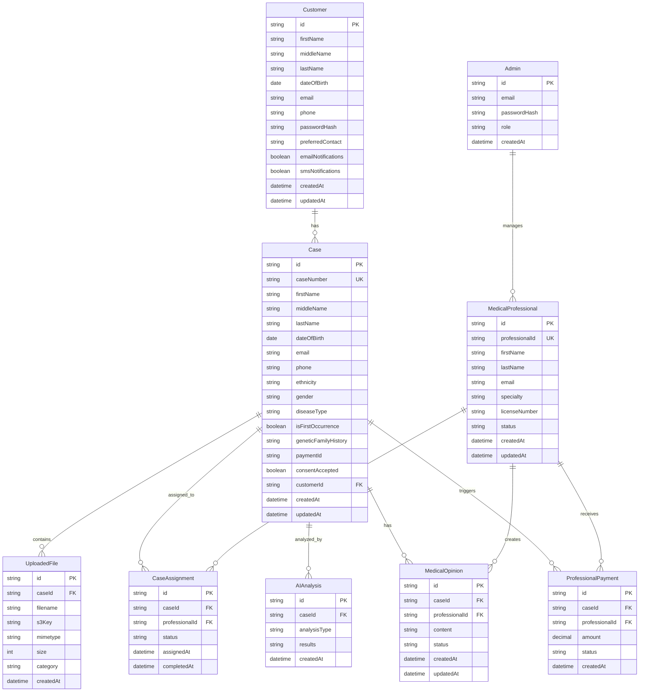

## 🔐 Security Architecture

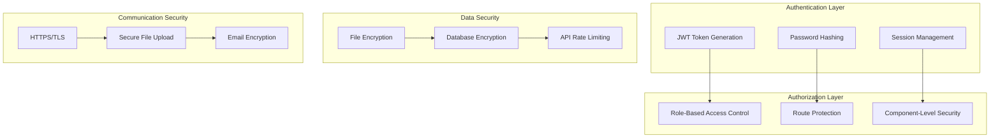

## 📱 User Interface Flow

### Patient Journey

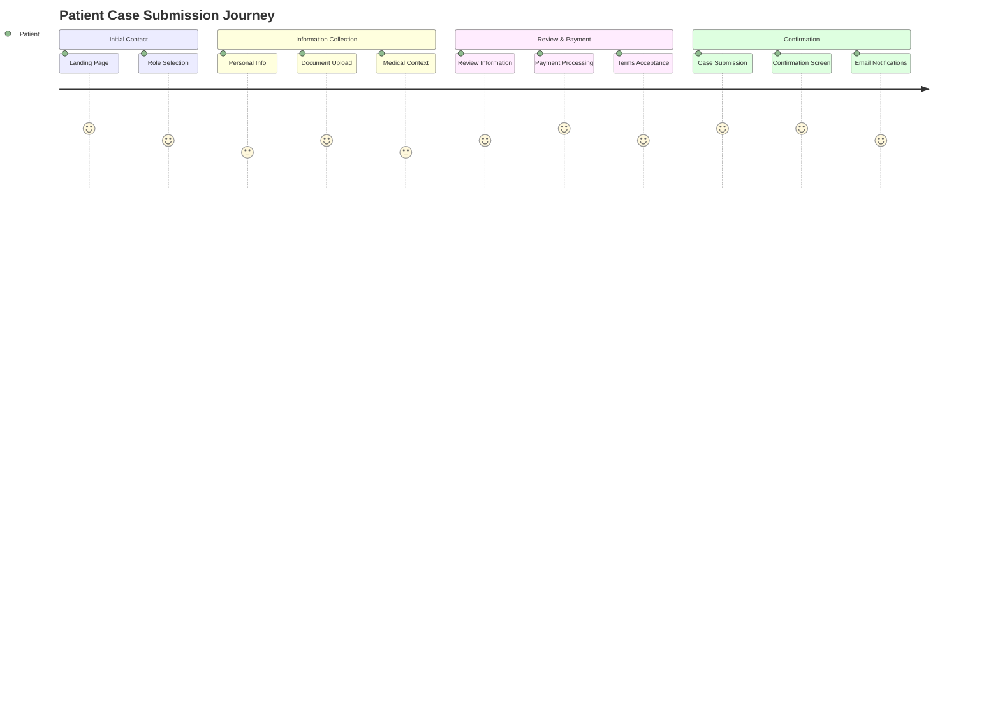

### Professional Journey

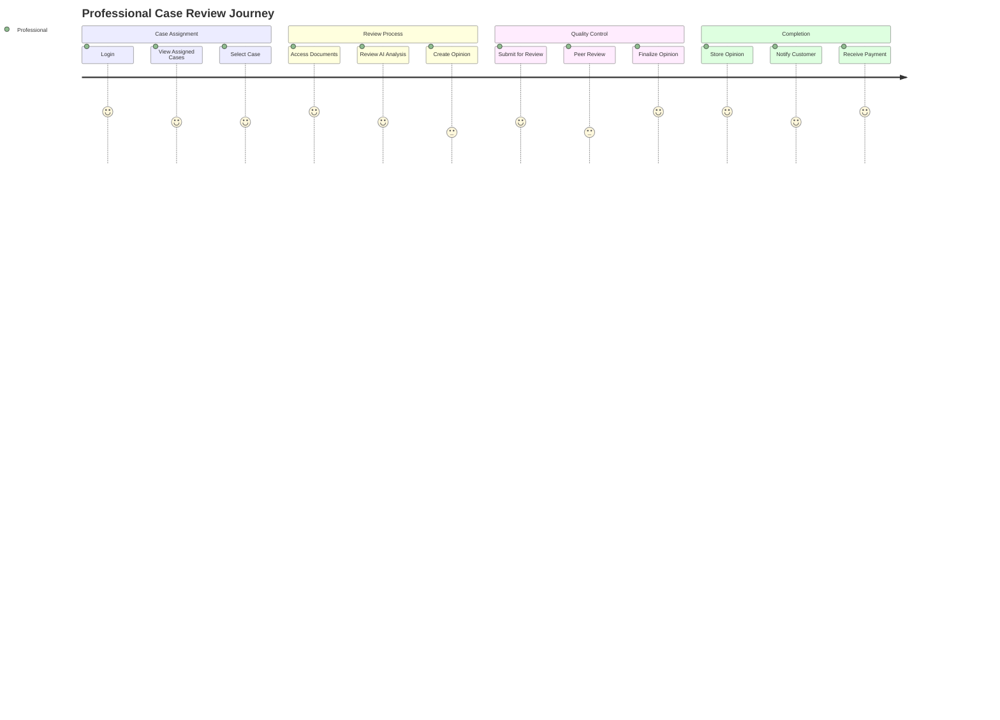

## 🔧 Technical Stack Architecture

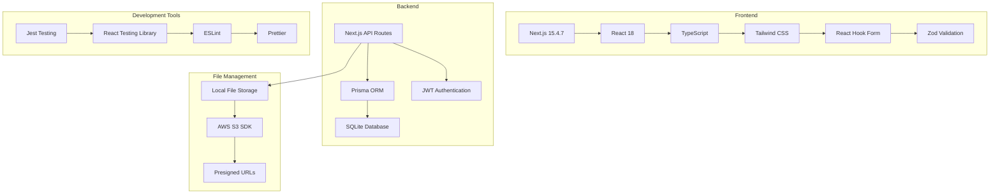

## 📈 Performance Architecture

```mermaid
graph TD
    subgraph "Frontend Performance"
        A[Code Splitting]
        B[Lazy Loading]
        C[Image Optimization]
        D[CSS Optimization]
    end
    
    subgraph "Backend Performance"
        E[Database Indexing]
        F[Query Optimization]
        G[Connection Pooling]
        H[Caching Strategy]
    end
    
    subgraph "File Performance"
        I[Parallel Uploads]
        J[Chunked Uploads]
        K[Progress Tracking]
        L[Retry Logic]
    end
    
    subgraph "Monitoring"
        M[Error Tracking]
        N[Performance Metrics]
        O[User Analytics]
        P[System Health]
    end
    
    A --> B
    B --> C
    C --> D
    
    E --> F
    F --> G
    G --> H
    
    I --> J
    J --> K
    K --> L
    
    M --> N
    N --> O
    O --> P
```

## 🚀 Deployment Architecture

```mermaid
graph TD
    subgraph "Development Environment"
        A[Local Development]
        B[SQLite Database]
        C[Local File Storage]
        D[Hot Reload]
    end
    
    subgraph "Production Environment"
        E[Vercel/Netlify]
        F[PostgreSQL Database]
        G[AWS S3 Storage]
        H[CDN Distribution]
    end
    
    subgraph "CI/CD Pipeline"
        I[GitHub Actions]
        J[Automated Testing]
        K[Build Process]
        L[Deployment]
    end
    
    subgraph "Monitoring & Logging"
        M[Error Tracking]
        N[Performance Monitoring]
        O[Security Scanning]
        P[Backup Strategy]
    end
    
    A --> B
    B --> C
    C --> D
    
    E --> F
    F --> G
    G --> H
    
    I --> J
    J --> K
    K --> L
    
    M --> N
    N --> O
    O --> P
```

## 📋 Key Architectural Decisions

### 1. **Monolithic Next.js Application**
- **Rationale**: Simplified deployment, shared codebase, easier state management
- **Benefits**: Single codebase, unified authentication, shared components
- **Trade-offs**: Larger bundle size, less microservice flexibility

### 2. **SQLite for Development, PostgreSQL for Production**
- **Rationale**: Easy local development with production-ready scalability
- **Benefits**: Zero-config local setup, robust production database
- **Trade-offs**: Database migration complexity

### 3. **Local File Storage with S3 Fallback**
- **Rationale**: Development simplicity with production scalability
- **Benefits**: No external dependencies for development, secure production storage
- **Trade-offs**: Different storage APIs, migration complexity

### 4. **Role-Based Access Control**
- **Rationale**: Secure multi-tenant application with distinct user types
- **Benefits**: Clear separation of concerns, secure access control
- **Trade-offs**: Complex routing logic, role management overhead

### 5. **Multi-Step Form Architecture**
- **Rationale**: Complex data collection with validation and user experience
- **Benefits**: Progressive disclosure, validation at each step, better UX
- **Trade-offs**: State management complexity, navigation logic

## 🔮 Future Architecture Considerations

### 1. **Microservices Migration**
- Separate services for each module (Repository, Customer Lifecycle, etc.)
- API Gateway for unified access
- Event-driven communication between services

### 2. **Real-time Features**
- WebSocket integration for live updates
- Real-time notifications
- Live chat between professionals and customers

### 3. **Advanced AI Integration**
- Direct AI service integration
- Machine learning for case prioritization
- Automated document analysis

### 4. **Mobile Application**
- React Native or Flutter mobile app
- Offline capability
- Push notifications

### 5. **Internationalization**
- Multi-language support
- Regional compliance (GDPR, HIPAA, etc.)
- Localized payment processing

---

*This architecture documentation provides a comprehensive overview of the Medical Second Opinion Platform's technical design, data flow, and system components.*

