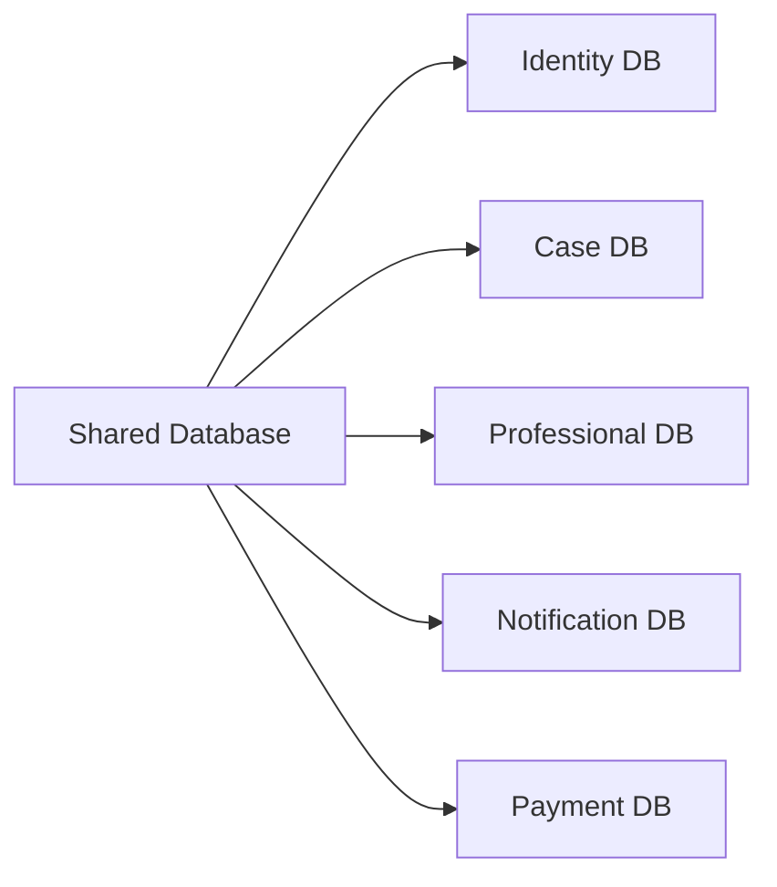
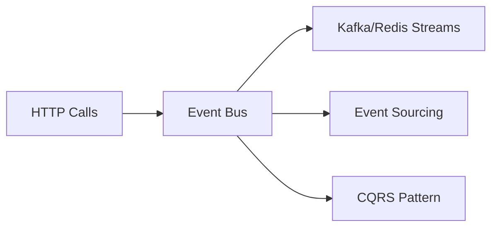
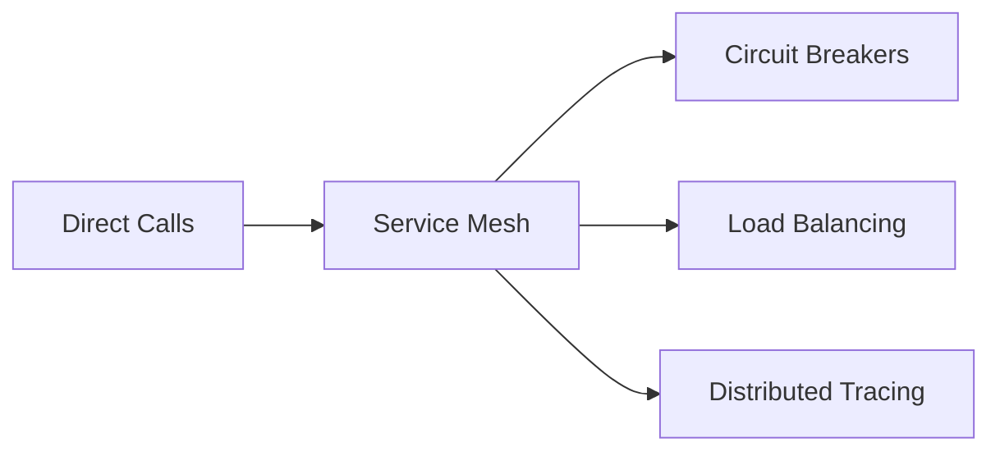

# Medical Second Opinion Platform - Comprehensive Architecture Analysis

## 🏗️ Architecture Assessment

### Current State: **Hybrid Microservices Architecture**

The Medical Second Opinion Platform exhibits characteristics of both **distributed monolith** and **true microservices**, currently in a **transitional hybrid state**.

## 📊 Complete System Architecture Diagram

```mermaid
graph TB
    %% User Layer
    subgraph "👥 User Layer"
        U1[Patients]
        U2[Medical Professionals] 
        U3[Administrators]
        U4[Customer Support]
    end

    %% Load Balancer & API Gateway
    subgraph "🌐 Entry Layer"
        LB[Load Balancer / API Gateway]
        CDN[CDN / Static Assets]
    end

    %% Frontend Layer
    subgraph "🖥️ Frontend Layer (Port 4000)"
        FE[Next.js 15.4.7 Frontend]
        subgraph "Frontend Features"
            FE1[8-Step Case Submission]
            FE2[Expertise Level Selection]
            FE3[Cross-Browser Testing]
            FE4[Customer Portal]
            FE5[Professional Portal]
            FE6[Admin Dashboard]
        end
    end

    %% Microservices Layer
    subgraph "🔧 Microservices Layer"
        subgraph "Core Services"
            MS1[Identity Service<br/>Port 4001]
            MS2[Case Management<br/>Port 4002]
            MS3[AI Analysis<br/>Port 4003]
            MS4[Professional Service<br/>Port 4004]
            MS5[Notification Service<br/>Port 4005]
        end
        
        subgraph "Extended Services"
            MS6[Recruitment Service<br/>Port 4006]
            MS7[Payment & Billing<br/>Port 4007]
            MS8[Workplace Service<br/>Port 4008]
            MS9[Admin Service<br/>Port 4009]
            MS10[Workflow Engine<br/>Port 4010]
        end
    end

    %% Data Layer
    subgraph "💾 Data Layer"
        subgraph "Primary Database"
            PG[(PostgreSQL<br/>Port 5433<br/>Shared Database)]
        end
        
        subgraph "Caching & Session"
            REDIS[(Redis<br/>Port 6380<br/>Sessions & Cache)]
        end
        
        subgraph "File Storage"
            FS[Local File Storage<br/>Development]
            S3[AWS S3<br/>Production]
        end
    end

    %% Quality Assurance Layer
    subgraph "🧪 Quality Assurance"
        TM[Test Manager Agent]
        CB[Cross-Browser Testing<br/>105 Tests]
        VR[Visual Regression Tests]
        API_TEST[API Compatibility Tests]
    end

    %% External Services
    subgraph "🌍 External Services"
        EMAIL[Email Service<br/>SMTP/SendGrid]
        SMS[SMS Service<br/>Twilio]
        PAYMENT[Payment Gateway<br/>Stripe/PayPal]
        AI_EXT[External AI APIs<br/>OpenAI/Anthropic]
    end

    %% Connections - Users to Entry Layer
    U1 --> LB
    U2 --> LB  
    U3 --> LB
    U4 --> LB

    %% Entry Layer to Frontend
    LB --> FE
    CDN --> FE

    %% Frontend to Features
    FE --> FE1
    FE --> FE2
    FE --> FE3
    FE --> FE4
    FE --> FE5
    FE --> FE6

    %% Frontend to Microservices
    FE --> MS1
    FE --> MS2
    FE --> MS3
    FE --> MS4
    FE --> MS5
    FE --> MS6
    FE --> MS7
    FE --> MS8
    FE --> MS9
    FE --> MS10

    %% Inter-service Communication
    MS1 -.->|Auth Validation| MS2
    MS1 -.->|Auth Validation| MS3
    MS1 -.->|Auth Validation| MS4
    MS2 -.->|Case Data| MS3
    MS2 -.->|Assignment| MS4
    MS2 -.->|Notifications| MS5
    MS7 -.->|Payment Status| MS5
    MS10 -.->|Workflow Events| MS5

    %% Microservices to Data Layer
    MS1 --> PG
    MS2 --> PG
    MS3 --> PG
    MS4 --> PG
    MS5 --> PG
    MS6 --> PG
    MS7 --> PG
    MS8 --> PG
    MS9 --> PG
    MS10 --> PG

    %% All services to Redis
    MS1 --> REDIS
    MS2 --> REDIS
    MS3 --> REDIS
    MS4 --> REDIS
    MS5 --> REDIS
    MS6 --> REDIS
    MS7 --> REDIS
    MS8 --> REDIS
    MS9 --> REDIS
    MS10 --> REDIS

    %% File Storage
    MS2 --> FS
    MS2 --> S3

    %% Quality Assurance
    TM --> CB
    TM --> VR
    TM --> API_TEST
    CB --> FE
    VR --> FE
    API_TEST --> MS1
    API_TEST --> MS2
    API_TEST --> MS3

    %% External Services
    MS5 --> EMAIL
    MS5 --> SMS
    MS7 --> PAYMENT
    MS3 --> AI_EXT

    %% Styling
    classDef frontend fill:#e1f5fe
    classDef microservice fill:#f3e5f5
    classDef database fill:#e8f5e8
    classDef external fill:#fff3e0
    classDef quality fill:#fce4ec

    class FE,FE1,FE2,FE3,FE4,FE5,FE6 frontend
    class MS1,MS2,MS3,MS4,MS5,MS6,MS7,MS8,MS9,MS10 microservice
    class PG,REDIS,FS,S3 database
    class EMAIL,SMS,PAYMENT,AI_EXT external
    class TM,CB,VR,API_TEST quality
```

## 🔍 Architecture Analysis

### **Assessment: Hybrid Distributed Architecture**

**Status**: **Transitional state between monolith and true microservices**

#### ✅ **Microservices Characteristics Present:**

1. **Service Decomposition**: 10 distinct services with domain separation
2. **Independent Deployment**: Each service runs on separate ports
3. **Technology Diversity**: Mix of Node.js services with different responsibilities
4. **Horizontal Scalability**: Stateless services that can scale independently
5. **API-First Design**: RESTful APIs with defined endpoints
6. **Container Ready**: Docker configurations available

#### ⚠️ **Distributed Monolith Characteristics:**

1. **Shared Database**: All services connect to the same PostgreSQL instance
2. **Tight Coupling**: Services share the same database schema
3. **Synchronous Communication**: Direct HTTP calls between services
4. **Deployment Coordination**: Services likely need coordinated deployment
5. **Schema Changes**: Database changes affect multiple services
6. **Data Consistency**: ACID transactions across service boundaries

### **Service Breakdown Analysis**

| Service | Port | Domain | Database | Independence Level |
|---------|------|--------|----------|-------------------|
| **Frontend** | 4000 | UI/UX | Shared | ⭐⭐⭐ Moderate |
| **Identity** | 4001 | Auth/Users | Shared | ⭐⭐ Limited |
| **Case Management** | 4002 | Medical Cases | Shared | ⭐⭐ Limited |
| **AI Analysis** | 4003 | AI Processing | Shared | ⭐⭐⭐ Moderate |
| **Professional** | 4004 | Medical Professionals | Shared | ⭐⭐ Limited |
| **Notification** | 4005 | Communications | Shared | ⭐⭐⭐⭐ High |
| **Recruitment** | 4006 | Professional Hiring | Shared | ⭐⭐⭐ Moderate |
| **Payment & Billing** | 4007 | Financial | Shared | ⭐⭐⭐ Moderate |
| **Workplace** | 4008 | Professional Tools | Shared | ⭐⭐⭐ Moderate |
| **Admin** | 4009 | Administration | Shared | ⭐⭐ Limited |
| **Workflow** | 4010 | Process Orchestration | Shared | ⭐⭐⭐ Moderate |

### **Current Architecture Strengths**

1. **✅ Service Separation**: Clear domain boundaries and responsibilities
2. **✅ Scalability Potential**: Services can be scaled independently
3. **✅ Development Teams**: Different teams can work on different services
4. **✅ Technology Flexibility**: Can use different tech stacks per service
5. **✅ Fault Isolation**: Service failures don't necessarily cascade
6. **✅ Cross-Browser Testing**: Enterprise-grade testing infrastructure
7. **✅ Security**: JWT-based authentication across services
8. **✅ Documentation**: Comprehensive architecture documentation

### **Current Architecture Limitations**

1. **❌ Shared Database**: Single point of failure and coupling
2. **❌ ACID Transactions**: Cross-service transactions are complex
3. **❌ Schema Coupling**: Database changes affect multiple services
4. **❌ Data Consistency**: No distributed transaction management
5. **❌ Service Discovery**: Direct port-based communication
6. **❌ Circuit Breakers**: Limited fault tolerance patterns
7. **❌ Event-Driven**: Minimal asynchronous communication
8. **❌ Observability**: Limited distributed tracing

## 🎯 **Microservices Maturity Assessment**

### **Current Maturity Level: 6/10 (Intermediate)**

**Category Breakdown:**
- **Service Design**: 7/10 - Good domain separation
- **Data Management**: 4/10 - Shared database coupling
- **Communication**: 5/10 - Mostly synchronous HTTP
- **Deployment**: 6/10 - Independent deployable units
- **Monitoring**: 5/10 - Basic health checks implemented
- **Security**: 8/10 - JWT authentication, HTTPS
- **Testing**: 9/10 - Comprehensive cross-browser testing
- **Documentation**: 8/10 - Well-documented architecture

## 🔄 **Evolution Path Recommendations**

### **Phase 1: Database Decomposition (High Priority)**

### **Phase 2: Event-Driven Communication**

### **Phase 3: Service Mesh & Observability**

## 📊 **Current vs. True Microservices Comparison**

| Aspect | Current State | True Microservices | Gap |
|--------|---------------|-------------------|-----|
| **Database** | Shared PostgreSQL | Database per service | 🔴 Major |
| **Communication** | HTTP REST | Events + REST | 🟡 Moderate |
| **Deployment** | Coordinated | Independent | 🟡 Moderate |
| **Data Consistency** | ACID | Eventual | 🔴 Major |
| **Service Discovery** | Static Ports | Dynamic Discovery | 🟡 Moderate |
| **Fault Tolerance** | Basic | Circuit Breakers | 🟡 Moderate |
| **Monitoring** | Basic Health | Full Observability | 🟡 Moderate |
| **Testing** | Excellent | Excellent | 🟢 Complete |

## 🎉 **Conclusion**

The **Medical Second Opinion Platform** has successfully evolved from a monolithic architecture into a **well-structured hybrid microservices architecture**. While not yet a "pure" microservices implementation due to the shared database, it represents a **significant architectural advancement** with:

- ✅ **10 independent services** with clear domain boundaries
- ✅ **Enterprise-grade testing** infrastructure (105 cross-browser tests)
- ✅ **Production-ready features** including dynamic pricing and cross-browser compatibility
- ✅ **Scalable foundation** ready for further microservices evolution
- ✅ **Comprehensive documentation** and quality assurance

**Current Classification**: **Distributed Service Architecture** with strong microservices characteristics and clear evolution path to full microservices architecture.

**Recommendation**: The current architecture effectively serves the platform's needs while providing a solid foundation for continued microservices evolution. The shared database should be the next major architectural improvement priority.