# Medical Second Opinion Platform - Flowcharts

## 🎯 Key Business Process Flowcharts

### 1. Complete Patient Journey Flowchart

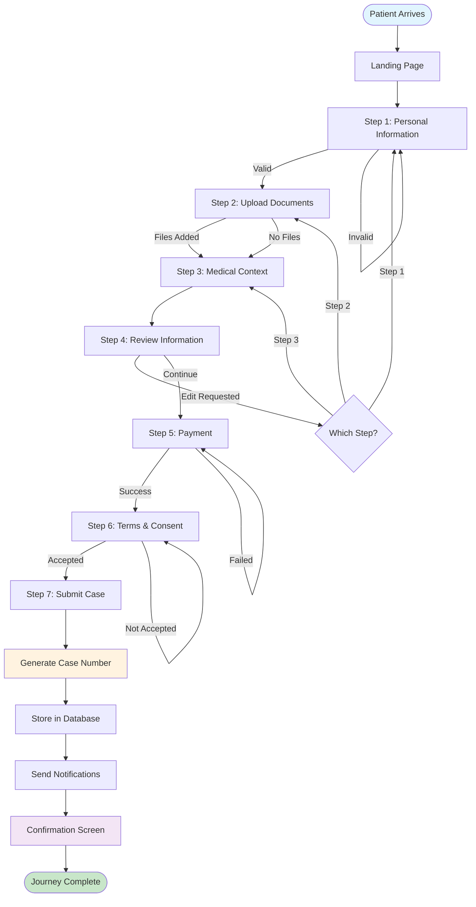

### 2. File Upload Process Flowchart

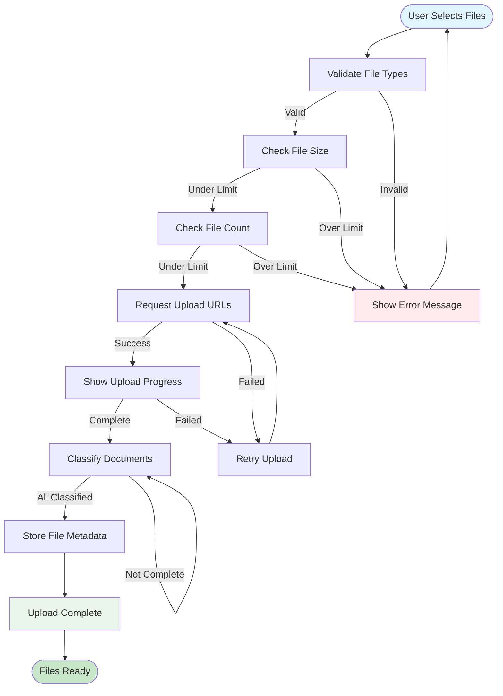

### 3. Case Assignment and Review Flowchart

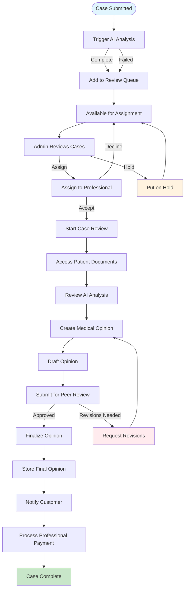

### 4. Customer Portal Access Flowchart

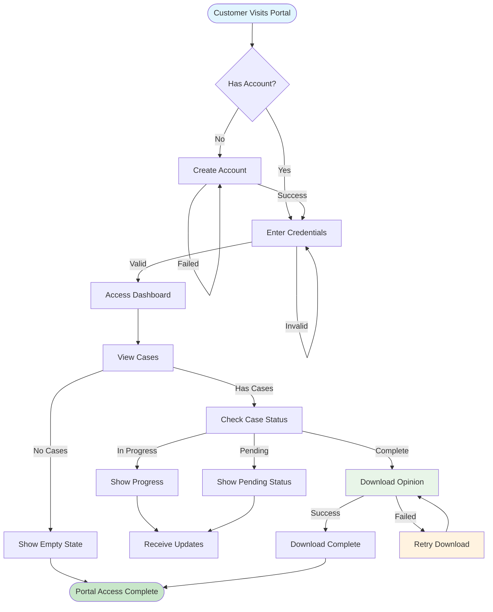

### 5. Professional Application and Vetting Flowchart

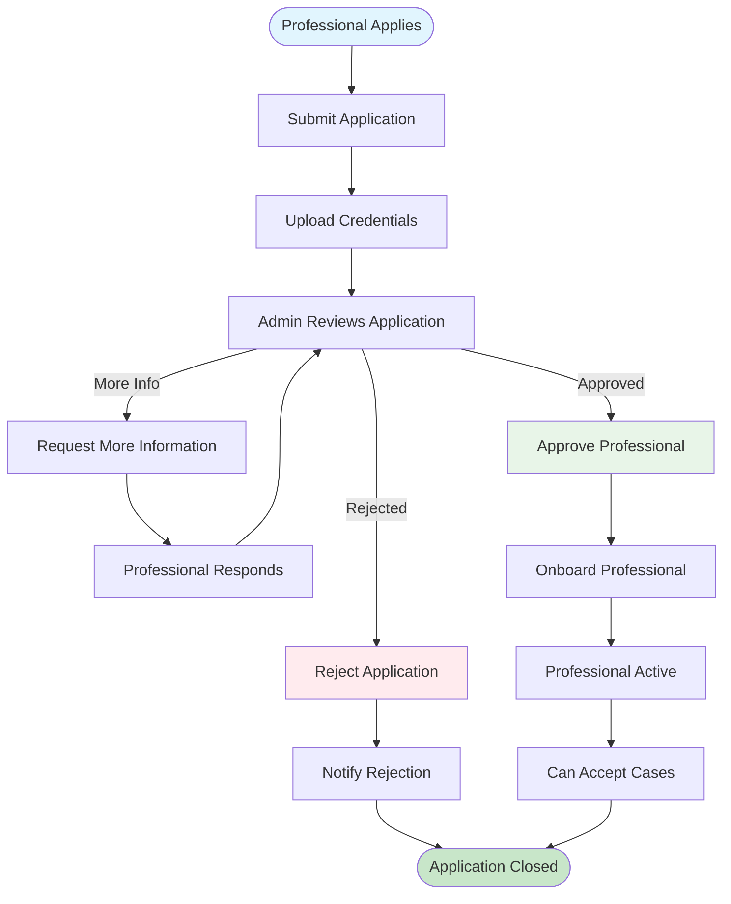

### 6. Payment Processing Flowchart

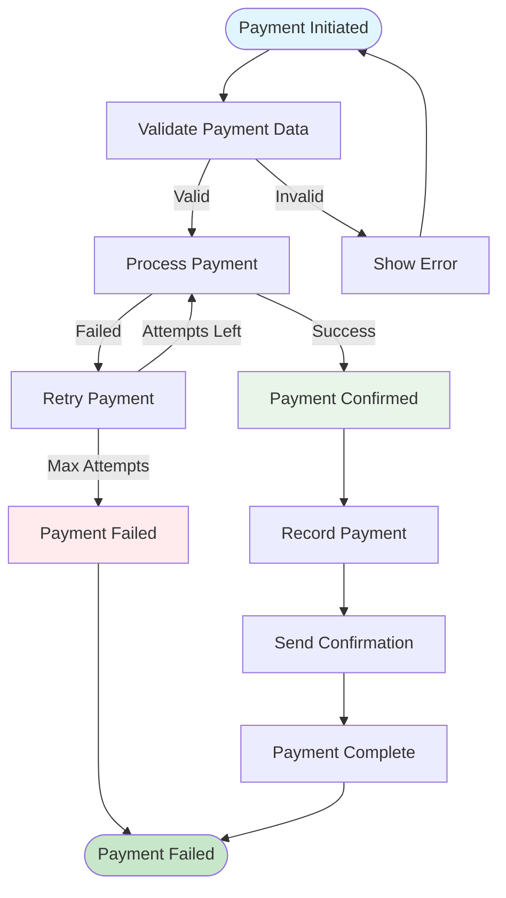

### 7. Error Handling and Recovery Flowchart

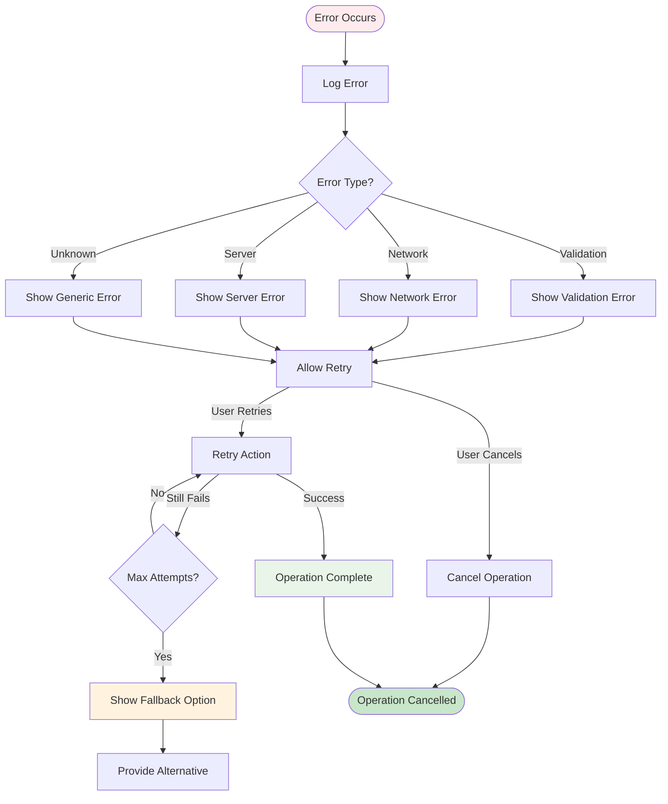

### 8. Data Flow Between Modules Flowchart

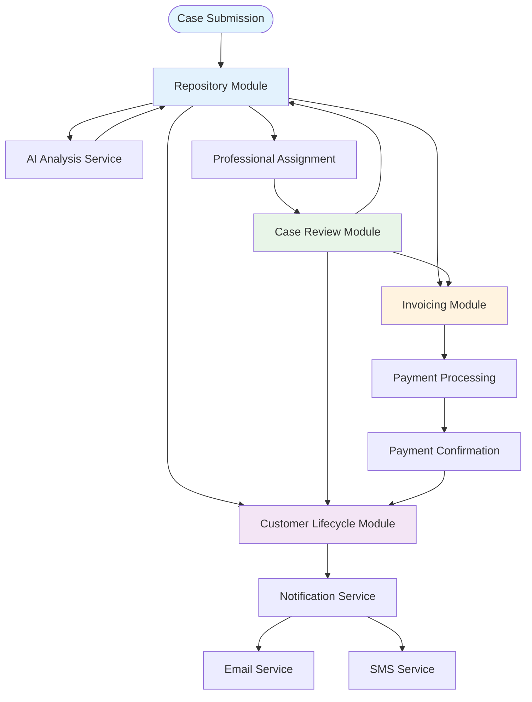

### 9. Security and Authentication Flowchart

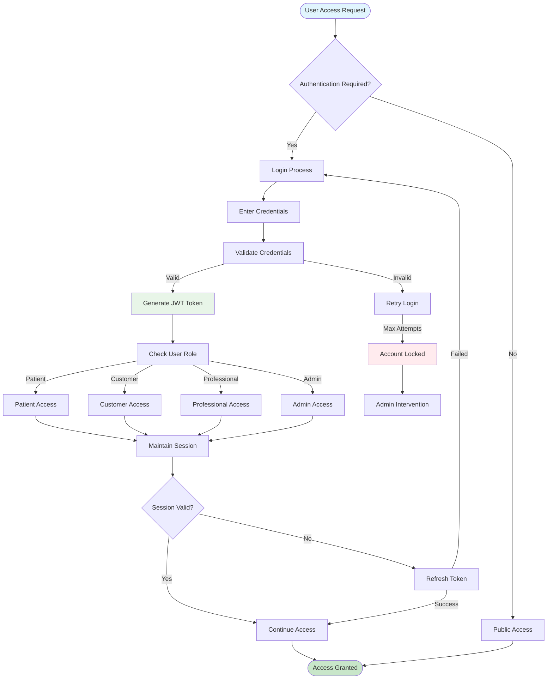

### 10. System Health and Monitoring Flowchart

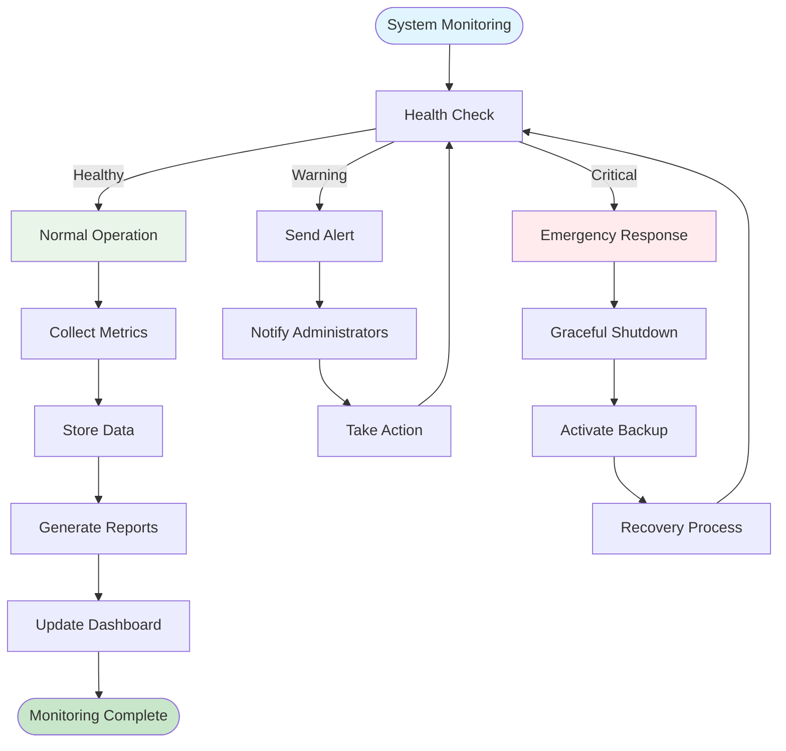

## 📊 Decision Tree Diagrams

### 1. Case Assignment Decision Tree

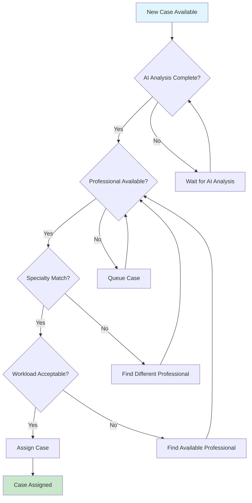

### 2. File Upload Decision Tree

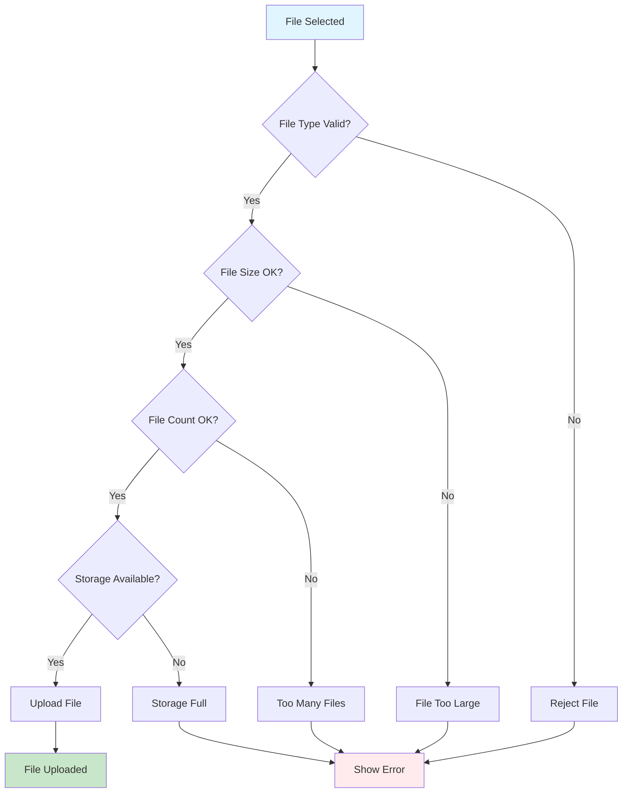

## 🔄 State Machine Diagrams

### 1. Case State Machine

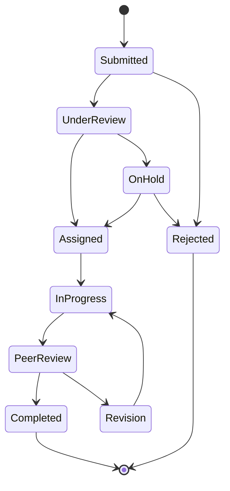

### 2. Professional Status State Machine

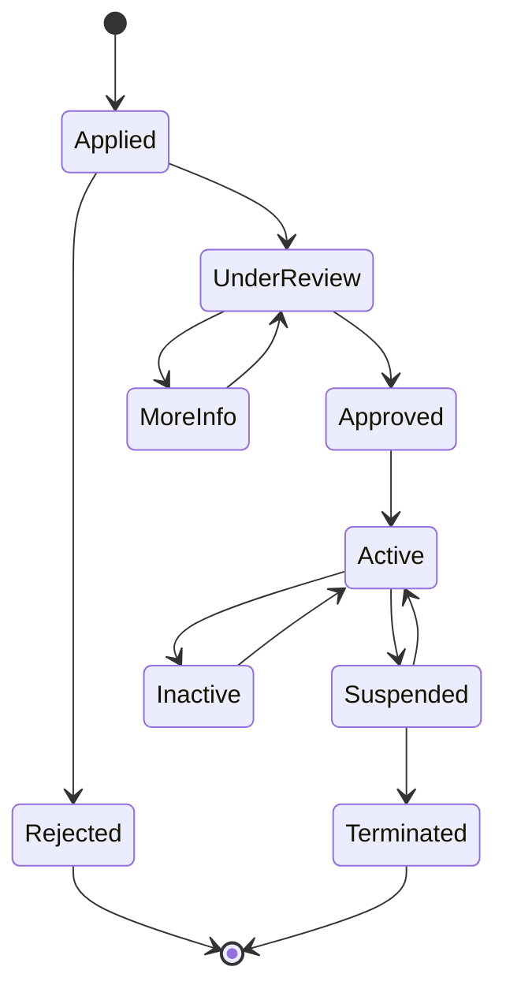

---

*These flowcharts provide detailed visual representations of the key business processes, decision points, and system interactions within the Medical Second Opinion Platform.*
